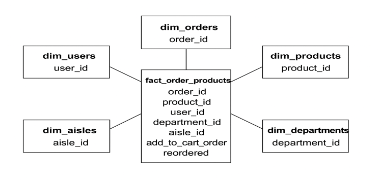
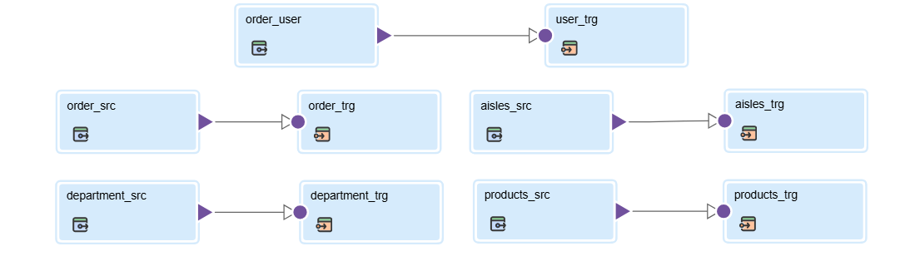
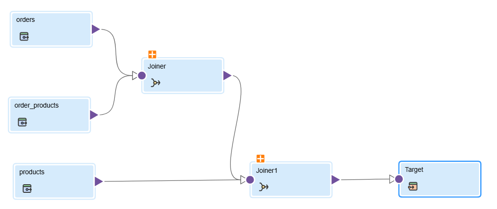

📦 E-Commerce Data Warehouse Project

Oracle | Informatica IDMC | Snowflake

An end-to-end Data Engineering project demonstrating how transactional E‑Commerce data is extracted from Oracle OLTP, transformed using Informatica Intelligent Data Management Cloud (IDMC), and loaded into Snowflake for analytics and reporting.

🚀 Project Overview

This project builds a complete data pipeline for an E‑Commerce platform, following industry-standard data warehousing and ETL practices. It is designed to showcase real-world skills required for Data Engineer / ETL Developer roles.

🎯 Objectives

Design a Dimensional Model (Star Schema) for analytics

Load raw CSV data into Oracle using SQL*Loader

Integrate Oracle → Snowflake using Informatica IDMC

Build automated ETL jobs for daily refresh

Enable fast and scalable analytics on Snowflake

🏗️ Architecture Overview

Data Flow:

Source – E‑Commerce CSV files

Staging / OLTP – Oracle Database (de.de25 schema)

ETL Layer – Informatica IDMC mappings

Data Warehouse – Snowflake (Star Schema)

🗄️ Oracle Implementation (OLTP)

Loaded CSV files using SQL*Loader

Designed normalized OLTP tables:

orders

products

order_products

aisles

departments

Defined Primary Keys & Foreign Keys

Ensured referential integrity

⭐ Dimensional Model (Snowflake)

Dimension Tables

DIM_USERS (user_id)

DIM_PRODUCTS (product_id, product_name)

DIM_AISLES (aisle_id, aisle)

DIM_DEPARTMENTS (department_id, department)

DIM_ORDERS (order_id, order_number, order_dow, order_hour_of_day)

Fact Table
### 🗂️ ERD Diagram

FACT_ORDER_PRODUCTS

Grain: One row per product per order

Columns:

order_id

product_id

user_id

department_id

aisle_id

add_to_cart_order

reordered

🔄 Informatica IDMC Integration

Connections
## 📊 Project Diagrams & ETL Screenshots

### 🔗 Informatica Connection

Oracle (On‑Premise)

Snowflake (Cloud)

Mappings

Mapping 1: Oracle → Snowflake (Dimension Tables)

### 📐 Dimension Mapping

Mapping 2: Oracle → Snowflake (Fact Table)
### 📊 Fact Mapping

Scheduling

Daily ETL Job for automated data refresh

📐 ER / Star Schema Diagram

This project follows a Star Schema design with a central fact table and multiple dimension tables to simplify reporting and improve query performance.

(ERD and Star Schema diagrams are available in the diagrams/ folder)

📊 Results & Insights
### 🔄 ETL Execution Status

Daily synchronization between Oracle and Snowflake

Reliable and scalable ETL using Informatica IDMC

Optimized reporting through dimensional modeling

Ready for BI dashboards and analytical queries

🧠 Skills Demonstrated

Data Warehousing & Dimensional Modeling

Oracle SQL & SQL*Loader

Snowflake SQL

Informatica IDMC (ETL)

Star Schema Design

Git & GitHub

✅ Conclusion

This E‑Commerce Data Warehouse project demonstrates seamless integration between Oracle, Informatica IDMC, and Snowflake, delivering a clean, automated, and scalable data pipeline suitable for modern analytics and enterprise reporting.
